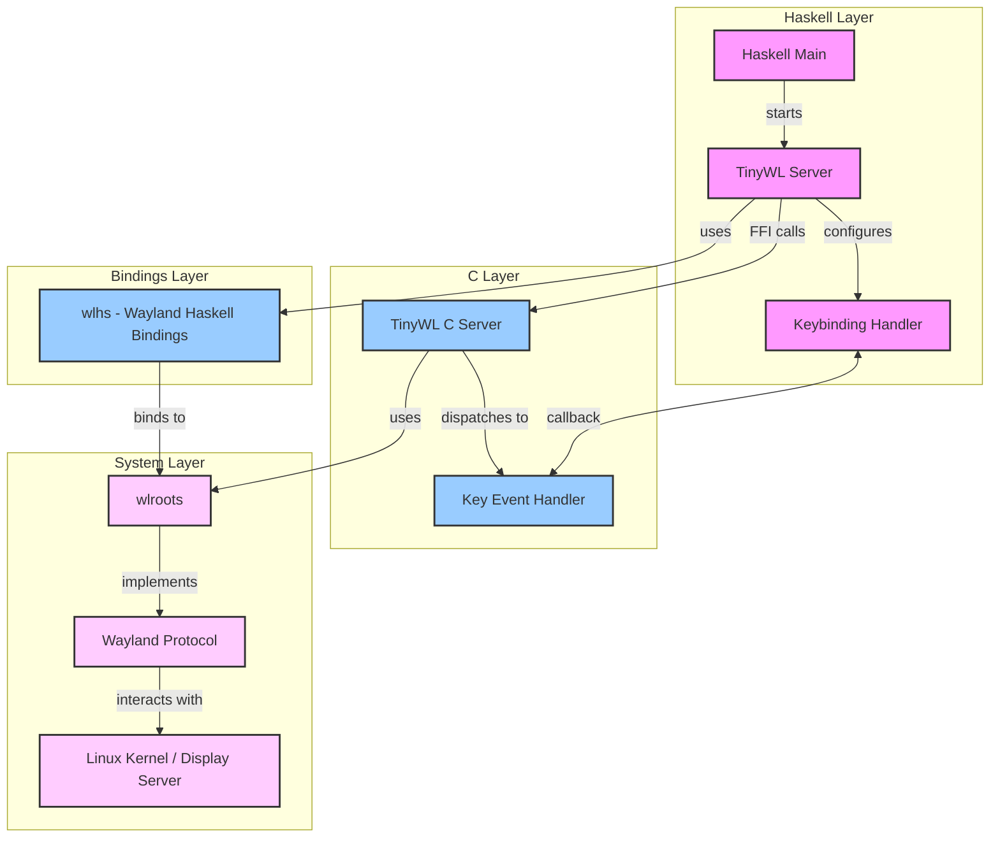

# TinyWL Haskell Implementation

## Project Overview

A Wayland compositor written in Haskell, providing a configurable and programmable window management system. This project implements the TinyWL reference compositor with Haskell bindings, allowing for dynamic configuration and control through Haskell.

## Features

- Wayland compositor functionality with wlroots backend
- Configurable key bindings through Haskell
- Window management (move, resize, focus)
- Dynamic terminal spawning
- Window cycling

More features coming, the intention is to get feature parity with something like sway

## System Architecture

The system is organized in multiple layers, providing a clean separation between Haskell control logic and low-level Wayland functionality:



### Layer Description

- **Haskell Layer**: High-level control and configuration
- **Bindings Layer**: Wayland protocol bindings for Haskell
- **C Layer**: Core compositor functionality
- **System Layer**: System-level Wayland and display server interaction

## Getting Started

### Prerequisites

- Nix package manager (for development environment)
- Git (for source code management)

### Installation

1. Clone the repository with submodules:

```bash
git clone --recurse-submodules https://github.com/l-Shane-l/tiny-wlhs.git
```

2. Set up the development environment:

```bash
nix-shell  # Or use direnv: direnv allow
```

3. Build and run:

```bash
cabal run
```

You can also pass an argument of a program to start with the -s flag.

`cabal run tiny-wlhs -- s "kitty"`

here "kitty" is the terminal emulator I use

### Basic Usage

Default key bindings:

- `Alt + Left Click`: Move window
- `Alt + Right Click`: Resize window
- `Alt + Esc` or `Alt + C`: Close server
- `Alt + s`: Open new terminal (configurable, default: kitty)
- `Alt + d`: Cycle between windows

### Configuration

Key bindings can be modified in:

- Terminal program: `ExampleCompositor.hs` (line 82)
- Window cycling: `tinywl.c` (line 104)

## Development Status

See [TODO.md](TODO.md) for current development status and planned features.

## Contributing

While the project is in early stages, contributions are welcome. See [CONTRIBUTING.md](CONTRIBUTING.md) for guidelines.

## Known Issues

- Some key combinations may not be available on certain system configurations
- Tested primarily on Debian with xmonad; other configurations may need adjustment

## License

This project is licensed under [LICENSE](LICENSE)

## Contact

For questions or suggestions:

- Email: shane@peregrinum.dev
- Issues: GitHub issue tracker
