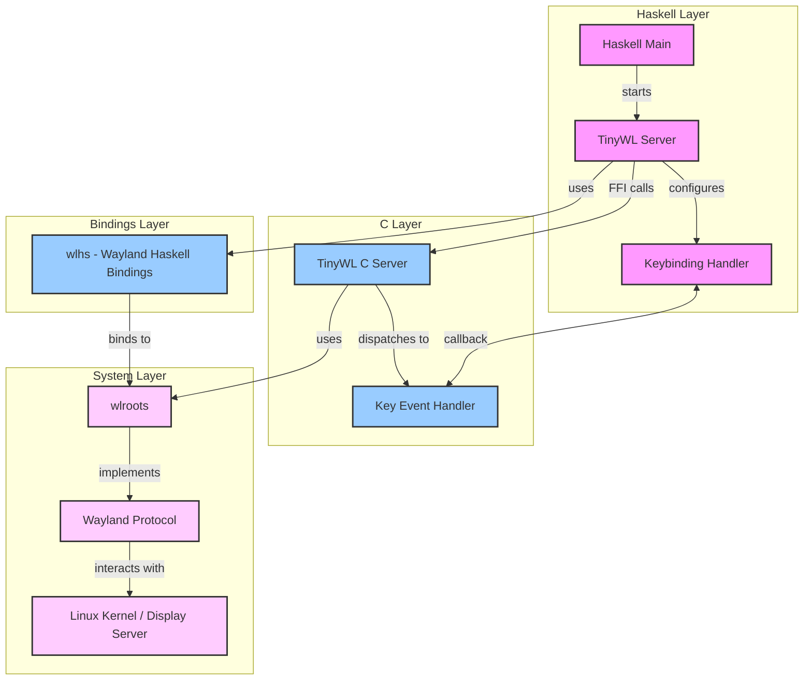

# TinyWL Haskell Implementation

A Wayland compositor written in Haskell, providing a configurable and programmable window management system. This project implements the TinyWL reference compositor with Haskell bindings, allowing for dynamic configuration and control through Haskell.

The app can be configured in Config.hs

## PLEASE NOTE this project is still under development and is not yet ready for use as a daily driver.

## Features

- Wayland compositor functionality with wlroots backend
- Configurable key bindings through Haskell
- Window management (move, resize, focus)
- Dynamic terminal spawning
- Window cycling
- Support for application spawners like bemenu
- Support for notification daemons like mako
- Support for simple bars like yambar (more complex bars like waybar is not support yet)
- Can be run from an X11 session or a TTY
- Spawn processes at startup, configure via Haskell
- Window borders
- Background with something like swaybg
- Wayland layer support for background, bottom, top, and overlay
- Support for reserved areas

More features coming, the intention is to get feature parity with something like sway or xmonad

## DEMO


## System Architecture

The system is organized in multiple layers, providing a clean separation between Haskell control logic and low-level Wayland functionality:



### Layer Description

- **Haskell Layer**: High-level control and configuration
- **Bindings Layer**: Wayland protocol bindings for Haskell
- **C Layer**: Core compositor functionality
- **System Layer**: System-level Wayland and display server interaction

## Getting Started

### Prerequisites

- Nix package manager (for development environment)
- Git (for source code management)

### Installation

1. Clone the repository with submodules:

```bash
git clone --recurse-submodules https://github.com/l-Shane-l/tiny-wlhs.git
```

2. Set up the development environment:

```bash
nix-shell  # Or use direnv: direnv allow
```

3. Build and run:

```bash
cabal run
```

### Basic Usage

Default key bindings:

- `Mod + Left Click`: Move window
- `Mod + Right Click`: Resize window
- `Mod + Esc` or `Alt + C`: Close server
- `Mod + s`: Open terminal (default: kitty)
- `Mod + d`, `Mod + v`, or `Mod + l`: Cycle between windows
- `Mod + a`: Launch bemenu-run

### Configuration

The compositor is configured through the `Config` type in `Config.hs`:

```haskell
data Config = Config
    { logLevel :: WLR_log_importance
    , modKey :: Modifier
    , onStartup :: IO ()
    , onKeyPress :: State -> CUInt -> IO ()
    , startupApplication :: String
    }

data State = State
    { display :: Ptr WlDisplay
    , server :: Ptr TinyWLServer
    }
```

Configuration is done in `Main.hs`. Here's an example configuration:

```haskell
appConfig :: Config
appConfig = Config
        { logLevel = WLR_DEBUG -- WLR_INFO | WLR_DEBUG | WLR_SILENT | WLR_ERROR
        , startupApplication = "" -- can be any app that works with wayland
        , onStartup = handleStartup
        , onKeyPress = handleKeyPress
        , modKey = ModAlt -- ModAlt | ModCtrl | ModLogo | ModShift
        }
    where
        terminalEmulator = "kitty" -- Terminal emulator choice
```

#### Startup Applications

Configure startup applications in the `handleStartup` function:

```haskell
handleStartup = do
    startUpProcess [ ("yambar", [])
                  , ("swaybg", ["-i", "./images/haskell.png", "-m", "fill"])
                  ]
```

#### Key Bindings

Key bindings are configured in the `handleKeyPress` function. Example:

```haskell
handleKeyPress state sym = do
    wlr_log WLR_INFO $ "Handler called with sym: " ++ show sym

    -- Spawn terminal with Mod + s
    when (sym == keySymToInt KEY_s) $ do
        wlr_log WLR_INFO "Mod + s pressed, spawning a terminal emulator"
        _ <- spawnProcess terminalEmulator []
        pure ()

    -- Launch bemenu with Mod + a
    when (sym == keySymToInt KEY_a) $ do
        wlr_log WLR_INFO "Mod + a pressed, running beMenu"
        _ <- spawnProcess "bemenu-run"
            [ "-i", "-l", "10", "-p", "run:"
            , "--tb", "#285577", "--tf", "#ffffff"
            , "--fb", "#222222", "--ff", "#ffffff"
            , "--nb", "#222222", "--nf", "#888888"
            , "--hb", "#285577", "--hf", "#ffffff"
            , "--fn", "monospace 12"
            , "-W", terminalEmulator ++ " -e"
            ]
        pure ()

    -- Cycle windows with Mod + d, v, or l
    when (sym == keySymToInt KEY_d ||
          sym == keySymToInt KEY_v ||
          sym == keySymToInt KEY_l) $ do
        wlr_log WLR_INFO "Mod + d pressed, cycling windows"
        result <- cycleWindows state
        if result
            then wlr_log WLR_INFO "window cycled"
            else wlr_log WLR_INFO "Window cycling failed, Only one window"
        pure ()
```

## Development Status

See [TODO.md](TODO.md) for current development status and planned features.

## Contributing

While the project is in early stages, contributions are welcome. See [CONTRIBUTING.md](CONTRIBUTING.md) for guidelines.

## Known Issues

- Some key combinations may not be available on certain system configurations
- Tested primarily on Debian with xmonad; other configurations may need adjustment

## License

This project is licensed under [LICENSE](LICENSE)

## Contact

For questions or suggestions:

- Email: shane@peregrinum.dev
- Issues: GitHub issue tracker
