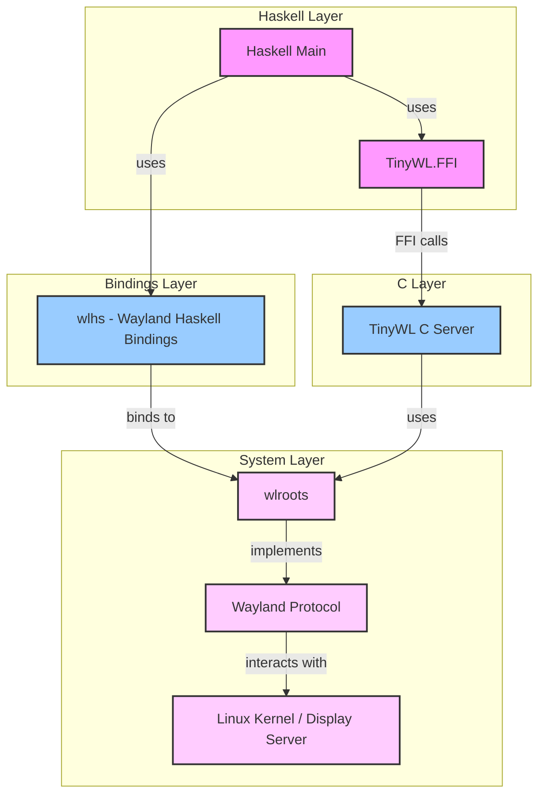
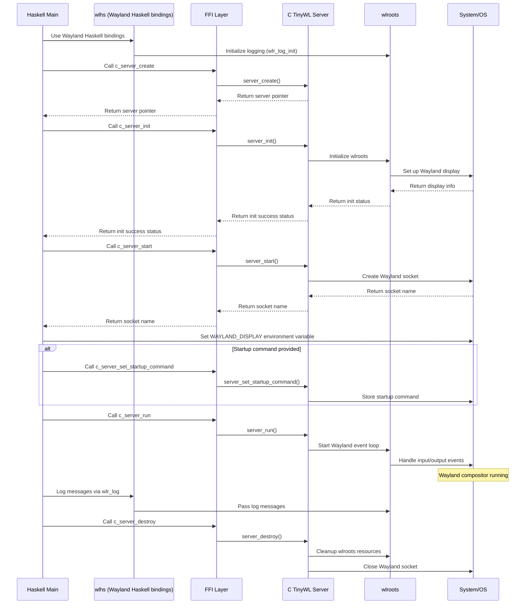

# TinyWL Haskell Implementation

## Project Overview
This project aims to create a total Haskell implementation of TinyWL (Tiny Wayland Compositor) using Haskell bindings for wlroots. The ultimate goal is to provide a way to test and validate Haskell bindings for the wlroots library.

## Current Status
Please check [TODO.md](TODO.md)

The project is currently in Stage 1 of development. I am working on refactoring TinyWL's main function into Haskell.

### Stage 1 Goal
Create a Haskell implementation of `c_main` that uses Haskell bindings and implements its logic in Haskell.

## System Architecture

### Component Overview

The following diagram shows the main components of our Wayland compositor and how they relate to each other:

### Operational Flow

This sequence diagram illustrates how these components interact during the lifecycle of the compositor:

## Getting Started
1. Ensure you have the submodules cloned down `git clone --recurse-submodules https://github.com/l-Shane-l/tiny-wlhs.git`
2. I created a shell.nix, you should be able to simply run `nix-shell` 
3. then `cabal run` 
4. tinywl will create a window you can play around with.
    - alt left click to move the window around and alt right click to resize it.

#### Note
- I ran created and tested this on a Debian laptop with xmonad, please let me know if you run into issues on other configurations

## Contributing
We welcome contributions to this project. This project is in its infancy however you can find an aspirational contrib guide here [CONTRIBUTING.md](CONTRIBUTING.md). At this early stage contributing won't be as strict as outlined; the only requirement will be a PR that moves towards the stated goals.

## License
[LICENSE](LICENSE)

## Contact
The best way to reach me is with an email to shane@peregrinum.dev
