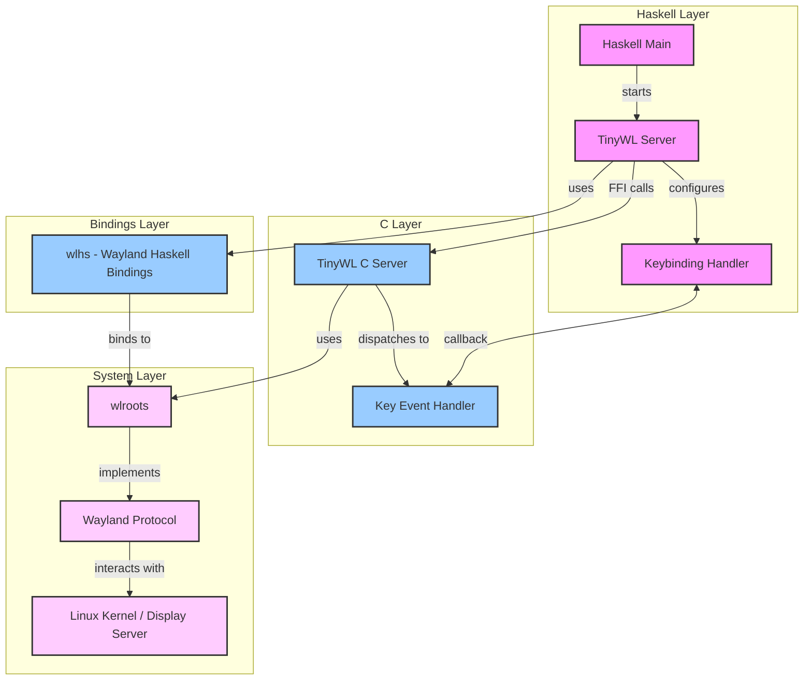

# TinyWL Haskell Implementation

## Project Overview

A Wayland compositor written in Haskell, providing a configurable and programmable window management system. This project implements the TinyWL reference compositor with Haskell bindings, allowing for dynamic configuration and control through Haskell.

The app can be configured in Config.hs

## Features

- Wayland compositor functionality with wlroots backend
- Configurable key bindings through Haskell
- Window management (move, resize, focus)
- Dynamic terminal spawning
- Window cycling

More features coming, the intention is to get feature parity with something like sway

## DEMO


## System Architecture

The system is organized in multiple layers, providing a clean separation between Haskell control logic and low-level Wayland functionality:



### Layer Description

- **Haskell Layer**: High-level control and configuration
- **Bindings Layer**: Wayland protocol bindings for Haskell
- **C Layer**: Core compositor functionality
- **System Layer**: System-level Wayland and display server interaction

## Getting Started

### Prerequisites

- Nix package manager (for development environment)
- Git (for source code management)

### Installation

1. Clone the repository with submodules:

```bash
git clone --recurse-submodules https://github.com/l-Shane-l/tiny-wlhs.git
```

2. Set up the development environment:

```bash
nix-shell  # Or use direnv: direnv allow
```

3. Build and run:

```bash
cabal run
```

### Basic Usage

Default key bindings:

- `Mod + Left Click`: Move window
- `Mod + Right Click`: Resize window
- `Mod + Esc` or `Alt + C`: Close server
- `Mod + s`: Open new terminal (configurable, default: kitty)
- `Mod + d` or `Mod + v` or `Mod + F1`: Cycle between windows

### Configuration

You can make all customizations in Config.hs

In appConfig you can set:

- Log Level
- Application to run on start
- The Mod Key
- Terminal Emulator

```
appConfig :: Config -- Customize your app here, to help I placed the options in the comments
appConfig =
    Config
        { logLevel = WLR_DEBUG -- WLR_INFO | WLR_DEBUG | WLR_SILENT | WLR_ERROR
        , startupApplication = "" -- can be any app that works with wayland, Leave blank for no startup app
        , modKey = ModAlt -- ModAlt | ModCtrl | ModLogo | ModShift
        , terminalEmulator = "kitty" -- I use kitty as my emulator, alacritty is also a popular choice
        }
```

You can also set up your own Key even listeners to do any of the following:

- spawn any process you like
- interact and control the compositor by calling FFI and Haskell functions in the LibTinyWLHS library
- change current key bindings to your preference

```
customKeybindings :: Ptr WlDisplay -> Ptr TinyWLServer -> IO (FunPtr (CUInt -> IO ()))
customKeybindings display server = do
    let handler :: CUInt -> IO ()
        handler sym = do
            -- Add your custom key event handler heres
            wlr_log WLR_INFO $ "Handler called with sym: " ++ show sym -- This will long as an int and key pressed while the mod key is held down
            when (sym == keySymToInt KEY_s) $ do
                -- simple match to key events defined in LibTinyWL.KeyBinding.KeySyms
                wlr_log WLR_INFO "Mod + s pressed, spawning a terminal emulator"
                _ <- spawnProcess (terminalEmulator appConfig) [] -- for this key event a process is spawned in Haskell
                pure ()
            when (sym == keySymToInt KEY_c) $ do
                -- the key Events just show up here as ints so you can also match against a raw int
                wlr_log WLR_INFO "Mod + c pressed closing server"
                FFI.c_wl_display_terminate display -- for this event we call a Wayland FFI function
                pure ()
            when (sym == keySymToInt KEY_d || sym == keySymToInt KEY_v) $ do
                -- You can also use logical OR
                wlr_log WLR_INFO "Mod + d pressed, cycling windows"
                result <- FFI.c_cycle_windows server
                (if result then wlr_log WLR_INFO "window cycled" else wlr_log WLR_INFO "Window cycling failed, Only one window")

                pure ()
    mkKeybindingHandler handler
```

## Development Status

See [TODO.md](TODO.md) for current development status and planned features.

## Contributing

While the project is in early stages, contributions are welcome. See [CONTRIBUTING.md](CONTRIBUTING.md) for guidelines.

## Known Issues

- Some key combinations may not be available on certain system configurations
- Tested primarily on Debian with xmonad; other configurations may need adjustment

## License

This project is licensed under [LICENSE](LICENSE)

## Contact

For questions or suggestions:

- Email: shane@peregrinum.dev
- Issues: GitHub issue tracker
